# Briefing

You will have to find the following information and test them as you go along in your program to experiment and understand how TypeScript will help you write your best code!

### LEVEL 1

- ## Which are the different primitive data types in TypeScript?

  The different 7 primitiveS data types are: string, number, boolean, symbol, null, undefined and bigint.
  The mains are string, number, boolean, null, undefined.

- ## How to type an Array?

  The array is declared when i write:  
   let nameOfArray : typeOfArray[] = [input value of array]

  TS infere the array, TS understand it's an array when i write:  
   let nameOfArray: [input a value (possibility with the different type on the array but not recommanded)]
  or  
   let nameOfArrays: Array<string> = ["value", "value", "valuee"]

- ## What is the `any` type?

  The any type is the all of type; after the value is defined, the type is defined.
  Never use any (otherwise there will be no detected type error) NB:les erreurs de type ne seront pas détectées

- ## How to type the return of a function as well as the type of its parameters?

  I can return the function with on the function "return ..operation will be desirate.." and specify the type after parenthesis of the name to the class:

  nameOfClass():input type of return

**🎉🎉🎉Update the Github Project board🎉🎉🎉**

### LEVEL 2

- ## What is a class? --> NB: créer la boîte typée qui peut ê réutilisée

  The class define a structur to object, and her features. She regroup data. Contrary to JS, TS add a type of attribut.
  It's like a blueprint( NB: c'est le plan, il le faut pr faire une maison mais tu ne peux pas habiter dedans ce dernier, idem recette).

  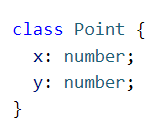

- ## What is a class constructor? --> autorise la construction d'objet, enregistre la boîte? stock?

  The constructor is a particulare method to initializes the properties (attributes) of the object created in the class; it is he who is called when creating an instance. It also offers the possibility of customizing the initial state of the object (NB: je px modifier l'élement [0] d'un array an ecrivant this.name[0]= name("cerise"), ce qui vient remplacer l'élement [0])
  Just one constructor on one class. I can't rename constructor.

  #Where?  
   I write the constructor in the class, just after creation of the class.

  #How do i write it?  
   constructor(nomQueL'OnVeutDonnerAl'AttributDsLeConstructeur: typeDeAttribut, etc. idem autres attributs){

  this.nomDeLaClasse = nomQueL'OnVeutDonnerAl'AttributDsLeConstructeur;
  this.nomDeLaClasse = nomQueL'OnVeutDonnerAl'AttributDsLeConstructeur;  
  etc.

  }

  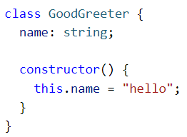

- ## What is a class instance? --> NB: creation d'un objet dans ma boite class specifique

  It is the instanciation and she can phone a method.

  #Where?  
   I write the instance just after the parent class

  #How do i write it?

  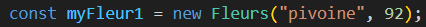

- ## How to check that a class is of a certain instance?

  I can check this when my mouse hover on my class with VSC (et ça s'affiche); or with a "console.log".

  #How do i write it?

  console.log(nomDeLaSousBoite instanceOf nomDeLaClasse);

  When it's ok, return true.

  #Where?

  Outside the class.

- ## What is `this` in a class?

  Allow to refer to, to selected; select just this instance, this object. In the method of my class.
  The 'this' init the properties, for take into account. The 'this' is on the constructor.

- ## What is a class method?

  She can influence the properties of instances, action of object; Differecen function/method: the function work without perso while methode is function like to an object; function has not link with object.

  #Where?  
  I write the method in the class, after the constructor.

  #How do i write it?

  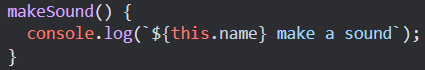

- ## What is the visibility of properties?

  The visibility determinate the accessibilty of the attribut.

- ## What is the difference between `public`, `private` and `protected`?

  This properties defined the visibility of the attribut.

  public= access everywhere of class

  private= access uniquely in class (not possible with the child)

  protected= access in class and in child of his parents'class

  When i don't precise a modified access to an attribut, the attribut is public.

  #Where?

  I Write this in the class, after the name of the attribute.

  #How do i write it?

  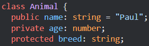

**🎉🎉🎉Update the Github Project board🎉🎉🎉**

### LEVEL 3

- ## How to split our program into different files? (e.g. a class in a file that I import into another)

  I can split my program on different files with the export and import instruction; with precise on the concernate class. It's is for organise a project and have a better readability.

- ## What is the `export` keyword?

  It is the instruction are write in the class where i take. It's for open the element of an files access.

  #Where?

  In the class where i can take.

  #How do i write it?

  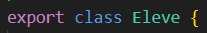

- ## What is the `import` keyword?

  It is the instruction to write in the classe who takes.

  #Where?

  In the class who wants to take.

  #How do i write it?

  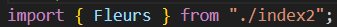

- ## What's inheritance?

  The inheritance is a child of an main class for a object programation; it's a extend of a parent'class(main class). This means that the child'class benefit to the properties of the parent'class(attibut and method).

  #Where?

  It's manage outside the parent'class but in the same file, same page.

  #How do i write it?

  I write this with the "extend" instruction, you can see in this picture:

  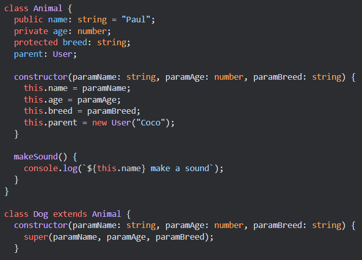

- ## How to call the constructor of a parent class?

I call the constructor of the parent'class with the "super()" instruction.

#Where?

In the constructor of the child'class.

#How do i write it?  

When i want use the a method of a parent'class in the child'class, i use this: --> super."nomDeLaMethodeInParentClass"() <--
When i want use just the attribut of the parent'class in the child'class:
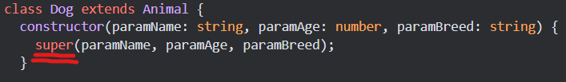

- ## How to call a method of a parent class?

I can call a method of a parent same a function.

#Where?

It's possible outside the class.

#How do i write it?

nomDeObjet.nomDeLaMethode();

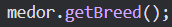

- ## What is polymorphism?

The polymorphism is an possiblity to use the object. He permit to uniformiz the object when he has a same common elements (example: a child method can use in a parent'class or a same name attrribut can have a differents type value).  
 
There is 2 polymorphism:

- The static polymorphism:  

  When a class have a many method with same name but the type of value is different. Polymorphism occurs when we have multiple classes that have the same method, but a different implementation of that same method. Polymorphism uses inheritance to use the same method with a different implementation.  

  #Where?
  In the class.

  #How do i write it?

  See the example:

  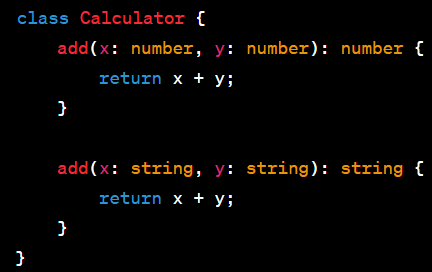

  When i write the good value in the console.log, he permite to interprate the tow type of value.

- The dinamic polymorphism: (NB: extension de la classe)  

  It allows you to use the attributes of a class by creating an extension of the class.

  #Where?

  Outside the class, when i declare my object.

  #How do i write it?

  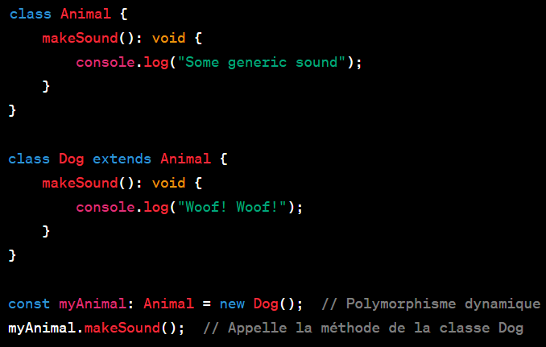

**🎉🎉🎉Update the Github Project board🎉🎉🎉**
