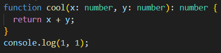

# Briefing

You will have to find the following information and test them as you go along in your program to experiment and understand how TypeScript will help you write your best code!

### LEVEL 1

- ## Which are the different primitive data types in TypeScript?

  The different 7 primitiveS data types are: string, number, boolean, symbol, null, undefined and bigint.
  The mains are string, number, boolean, null, undefined.

- ## How to type an Array?

  The array is declared when i write:  
   let nameOfArray : typeOfArray[] = [input value of array]

  TS infere the array, TS understand it's an array when i write:  
   let nameOfArray: [input a value (possibility with the different type on the array but not recommanded)]
  or  
   let nameOfArrays: Array<string> = ["value", "value", "valuee"]

- ## What is the `any` type?

  The any type is the all of type; after the value is defined, the type is defined.
  Never use any (otherwise there will be no detected type error) NB:les erreurs de type ne seront pas détectées

- ## How to type the return of a function as well as the type of its parameters?

  I can return the function with on the function "return ..operation will be desirate.." and specify the type after parenthesis of the name to the class:

  nameOfClass():input type of return



**🎉🎉🎉Update the Github Project board🎉🎉🎉**

### LEVEL 2

- ## What is a class? --> NB: créér la boîte typée qui peut ê réutilisée

  The class define a structur to object, and her features. She regroup data. Contrary to JS, TS add a type of attribut.
  It's like a blueprint( NB: c'est le plan, il le faut pr faire une maison mais tu ne peux pas habiter dedans ce dernier, idem recette).

  

- ## What is a class constructor? --> autorise la construction d'objet, enregistre la boîte? stock?

  The constructor is a particulare method to initializes the properties (attributes) of the object created in the class; it is he who is called when creating an instance. It also offers the possibility of customizing the initial state of the object (NB: je px modifier l'élement [0] d'un array an ecrivant this.name[0]= name("cerise"), ce qui vient remplacer l'élement [0])
  Just one constructor on one class. I can't rename constructor.

  Where? I write the constructor in the class, just after creation of the class.

  How do i write it?  
   constructor(nomQueL'OnVeutDonnerAl'AttributDsLeConstructeur: typeDeAttribut, etc. idem autres attributs){
  this.nomDeLaClasse = nomQueL'OnVeutDonnerAl'AttributDsLeConstructeur;
  this.nomDeLaClasse = nomQueL'OnVeutDonnerAl'AttributDsLeConstructeur;  
  etc.
  }

  

- ## What is a class instance? --> NB: creation d'un objet dans ma boite class specifique

  It is the instanciation and she can phone a method.

  Where? I write the instance just after the parent class

  How do i write it?

  

- ## How to check that a class is of a certain instance?

  I can check this when my mouse hover on my class with VSC (et ça s'affiche); or with a "console.log". Pour trier des resultats par ex.

  How do i write it?

  console.log( nomDeLaSousBoite instanceOf nomDeLaClasse);

  When it's ok, return true.

  Where?

  Outside the class.

- ## What is `this` in a class?

  Allow to refer to, to selected; select just this instance, this object. In the method of my class.
  The 'this' init the properties, for take into account. The 'this' is on the constructor.

- ## What is a class method?

  She can influence the properties of instances, action of object; Differecen function/method: the function work without perso while methode is function like to an object; function has not link with object.

  Where?  
  I write the method in the class, after the constructor.

  How do i write it?

  

- ## What is the visibility of properties?

  The visibility determinate the accessibilty of the attribut.

- ## What is the difference between `public`, `private` and `protected`?

This properties defined the visibility of the attribut.
public= access everywhere of class
private= access uniquely in class (not possible with the child)
protected= access in class and in child of his parents'class

Where?  
 I write this in the class, after the name of the attribute.

How do i write it?


**🎉🎉🎉Update the Github Project board🎉🎉🎉**

### LEVEL 3

- ## How to split our program into different files? (e.g. a class in a file that I import into another)

  I can split my program on different files with the export and import instruction; with precise on the concernate class.

- ## What is the `export` keyword?

  It is the instruction are write in the class where i take

- ## What is the `import` keyword?

  It is the instruction to write in the classe who takes

- ## What's inheritance?

  The inheritance is a child of an class manage outside the parent'class; it's for extend a class. It's possible with a constructor.

- ## How to call the constructor of a parent class?

  In the constructor, write super() to indicate it's relate un the parent'class

- ## How to call a method of a parent class?

- ## What is polymorphism?

**🎉🎉🎉Update the Github Project board🎉🎉🎉**

## Boss level

You've learned a lot of things! Now it's time to put it into practice through this exercise in pairs!

### Part 1 : Heroes

Create a `Hero` class that allows you to create objects with the following properties:

```ts
name: string;
power: number;
life: number;
```

And the methods

```ts
  attack(opponent: Hero)
  isAlive()
```

The `attack` method has an `opponent` parameter (of type `Hero`). It is necessary to reduce the number (`life`) of `opponent` by as much damage (`power`) of the attacker.

​*Example: If the Joan instance, attacks the Leon instance, it will be represented by this method call:*

```ts
joan.attack(leon);
```

The `isAlive` method should return `true` if the hero's life points are greater than zero and `false` otherwise.

Create two instances of `Hero` and check that the `attack` and `isAlive` methods work.

**Constraint to add**: you now have to make sure that the `name`, `power`, `life` properties are private. You will have to create methods to access their value and modify their value.

### Part 2 : Weapons

​
Create a `Weapon` class with the following property:

```ts
name: string;
```

Add the `weapon` attribute (of type `Weapon`) to the `Hero` class without modifying the constructor (so `weapon` is not initialized).

Create three classes `HeroAxe`, `HeroSword` and `HeroSpear` that inherit from `Hero`.

These three classes call the constructor of their parent and initialize `weapon` with instances of the `Weapon` class whose names will be `axe`, `sword` or `spear` as the case may be.

In the `HeroAxe`, `HeroSword` and `HeroSpear` classes, redefine the `attack` method to take into account the following cases:

- `HeroAxe` : if the type of `opponent` is `HeroSword`, multiply `power` by two
- `HeroSword` : if the type of `opponent` is `HeroSpear`, multiply `power` by two
- `HeroSpear` : if the type of `opponent` is `HeroAxe`, multiply `power` by two

Tip: use the `super` keyword to call the `attack` method of the parent class.
​
Create instances of the three classes `HeroAxe`, `HeroSword` and `HeroSpear` and check that their `attack` methods work correctly.
​

### Part 3 : Battle

Create a loop that makes two instances of subclasses `Hero` fight each other (they attack at the same time).

When at least one of them is dead, display `{heroName} wins`. If both are dead, display `It's a draw`.

**🎉🎉🎉Update the Github Project board🎉🎉🎉**

---

**_Bonus 1 : Weapon damage_**

_Add a `damage` property to the `Weapon` class and make sure it is initialized by the constructor._

_Edit the `attack` method of `Hero` so that the damage is calculated as follows: the hero's power `power` + the weapon's damage `power`_

**_Bonus 2 : User interface_**

_Create a user interface for the application (for example, with a choice of heroes and weapons, and a visual on the damage inflicted)_

# BRIEF-TimeScript
